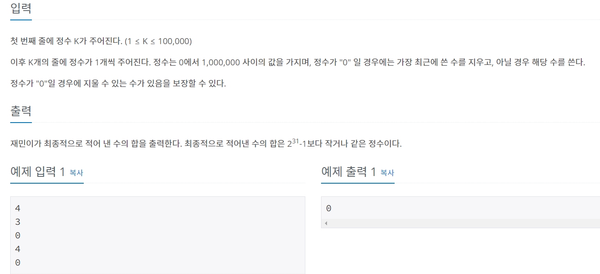

### 내가 푼 풀이
```py
import sys
input = sys.stdin.readline
n = int(input())
result = []
for i in range(n):
  m = int(input())
  if m != 0:
    result.append(m)
  else:
    result.pop()
print(sum(result))
```
- 최근에 배운 dfs 를 활용하여 0이 아니면 리스트에 추가
- 0이 아니면 가장 최근에 들어온 값을 제거해야하므로 pop을 사용
- 결과는 리스트 내에 합을 쓰면 됨