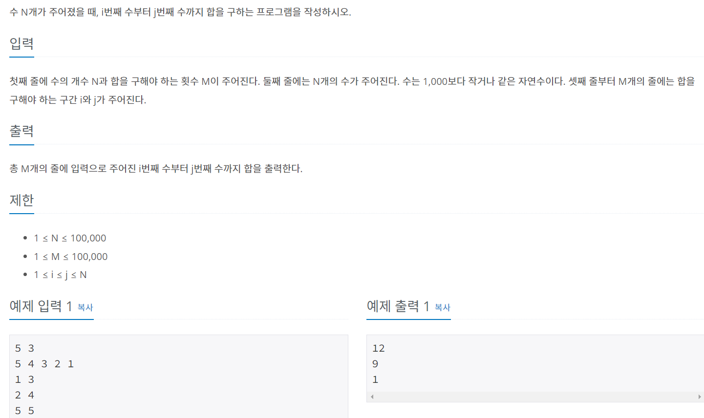

### 처음 푼 틀린 풀이
```py
import sys
input = sys.stdin.readline
n,m = map(int, input().split())
lis = list(map(int, input().split()))
for i in range(m):
  a,b = map(int,input().split())
  answer = 0
  for j in range(a-1,b):
    answer += lis[j]
  print(answer)
```
- 이 과정 속에서는 시간 초과로 시간 복잡도를 넘게 된다.
- 매 반복문에서 계속 누적합을 구하기에 생기는 문제!

### 다시 푼 옳은 풀이
```py
import sys
input = sys.stdin.readline
n,m = map(int, input().split())
lis = list(map(int, input().split()))
answer = [0]
zero = 0
for i in lis:
  zero +=i
  answer.append(zero)

for i in range(m):
  a,b = map(int,input().split())
  print(answer[b]-answer[a-1])
```
- 과정은 똑같지만 애초에 처음부터 누적합을 구해 리스트에 넣어준다.
- 처음 리스트에 0을 넣어준 이유는 헷갈리는 것을 줄이기 위해서!