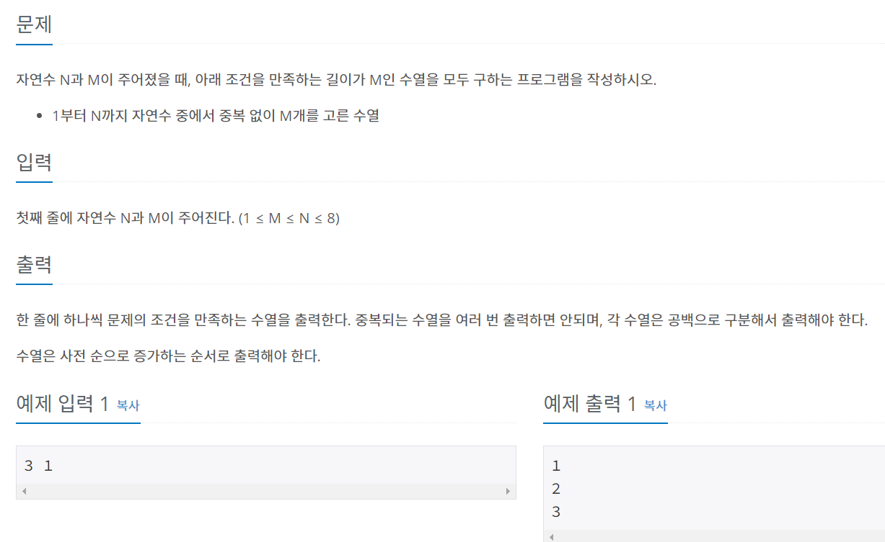

### 유튜브 공부
```
1. 아이디어
-백트래킹 재귀함수 안에서 for 돌면서 숫자 선택 (방문여부확인)
- 재귀함수에서 M개 선택시 print

2. 시간복잡도
중복이 가능할시 N^N (N=8까지 가능)
중복이 불가능할 시 N! (N=10까지 가능)
- N!

3. 자료구조
- 결과값 저장 int[]
- 방문여부 bool[]

```

### 코드
```py
import sys
input = sys.stdin.readline

N,M = map(int, input().split())
rs = []
chk = [False] * (N+1) #첫번째꺼가 0이니까 좀 더 편하게 하려고

def recur(num):
    if num == M:
        print(' '.join(map(str, rs)))
        return
    for i in range(1,N+1):
        if chk[i]==False:
            chk[i] = True
            rs.append(i)
            recur(num+1)
            chk[i] = False
            rs.pop()
recur(0)
```

- 백트래킹 문제는N이 10언저리
- 재귀함수 사용시, 종료시점 잊지말기