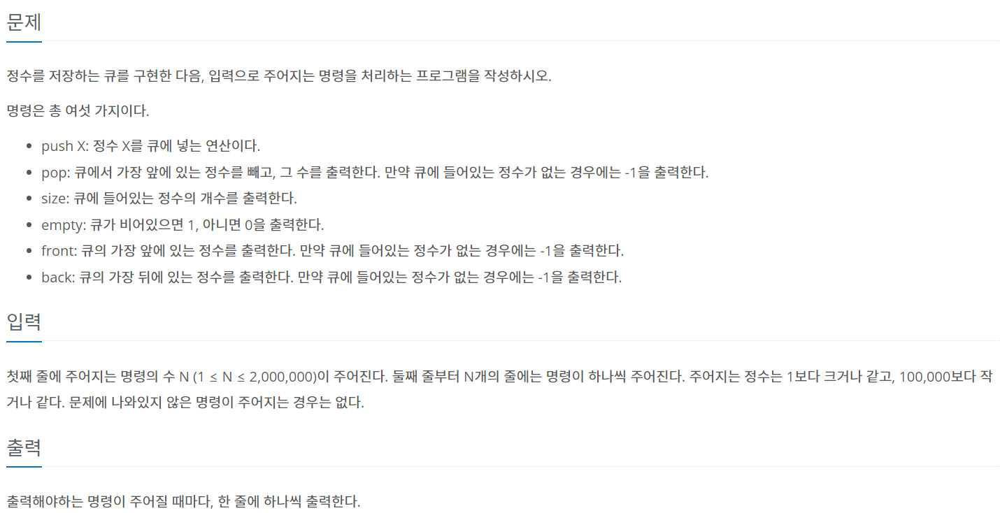

### 내가 푼 풀이
```py
import sys
from collections import deque
input = sys.stdin.readline
n = int(input())
que = deque([])
for i in range(n):
  a = input().split()
  if a[0] == 'push':
    que.append(a[1])
  elif a[0] == 'pop':
    if len(que) ==0:
      print(-1)
    else:
      print(que[0])
      que.popleft()
  elif a[0] == 'size':
    print(len(que))
  elif a[0] == 'empty':
    if len(que) ==0:
      print(1)
    else:
      print(0)
  elif a[0] == 'front':
    if len(que) ==0:
      print(-1)
    else:
      print(que[0])
  elif a[0] == 'back':
    if len(que) ==0:
      print(-1)
    else:
      print(que[-1]) 
```
- 이코테 책에서 배운 deque를 활용
- 큐 맨 앞 정수 빼기위해서는 popleft활용