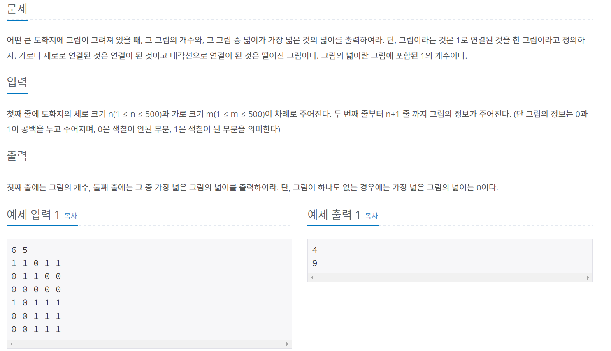

### 유튜브로 공부
- 풀이 전
```python
1. 아이디어
- 2중 for문 -> 값 1 & 방문X -> BFS
- BFS 돌면서 그림 개수 +1, 최대값을 갱신

2. 시간복잡도
- BFS : O(V+E)
- V : m * n = 500*500
- E : 대략 4*m*n
- V+E = 5*500*500 <2억 -> 가능!

3. 자료구조
- 그래프 전체 지도 : int [][]
- 방문 : bool [][]
- Queue(BFS)
```

- 코드
```python
import sys
input = sys.stdin.readline

n,m = map(int, input().split())
mapp = [list(map(int, input().split())) for _ in range(n)]
chk = [[False]*m for _ in range(n)]

cy = [0,1,0,-1]
cx = [1,0,-1,0]

def bfs(y,x):
    rs = 1
    q = deque()
    q.append((y,x))
    while q:
        ey, ex = q.popleft()
        for k in range(4):
            ny = ey + dy[k]
            nx = ex + dx[k]
            if 0<=ny <n and 0<=nx <m:
                if mapp[ny][nx] == 1 and chk[ny][nx] == False:
                    rs += 1
                    chk[ny][nx] = True
                    q.append((ny,nx))
    return rs


cnt = 0
maxi = 0
for j in range(n): #보통 y를 먼저 돌림
    for i in range(m):
        if map[j][i] == 1 and chk[j][i] == False:
            chk[j][i] = True
            cnt +=1
            maxi = max(maxi, bfs(j,i))
```