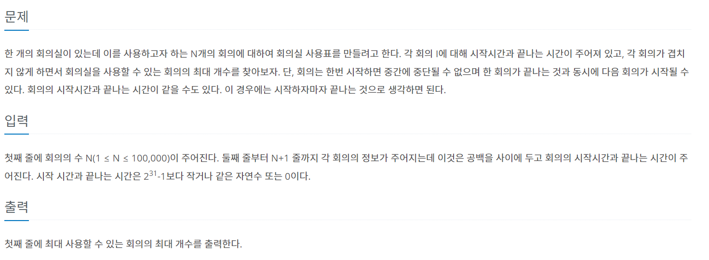

### 참고하여 풀이
참고: https://suri78.tistory.com/26

- 힘들었던 이유
1. 회의 시간이 짧은 것을 먼저 하여 풀이를 진행할 시 시간 조정으로 안맞을 수 있음
2. 시작 시간과 끝나는 시간에만 초점을 두니 풀이가 진행이 안됨

=> 방법 : 둘 다 신경을 쓰는 sort(key)를 사용해 끝나는 시간과 시작 시간 오름차순 정렬하여 양쪽 모두를 비교할 수 있음

```py
import sys
input = sys.stdin.readline
n = int(input())
m = [[0]*2 for _ in range(n)]
for i in range(n):
  a,b = map(int, input().split())
  m[i][0] = a
  m[i][1] = b
m.sort(key = lambda x: (x[1],x[0]))
cnt = 1
end = m[0][1]
for i in range(1,n):
  if m[i][0] >= end:
    cnt +=1
    end = m[i][1]
print(cnt)
```
1. 시작 시간과 끝나는 시간을 따로 받아줘서 새로운 리스트 안에 넣어준다.
2. 앞서 말한 sort(key)를 사용해 양쪽 모두의 조건을 고려하여 오름차순을 동시에 정렬한다.
3. 회의 총 시간에 따라 정렬한 것이므로 짧은 것이 먼저 온 것이니까 끝나는 시간과 비교해서 시작 시간이 크다면 1씩 증가하여 수를 세어줌