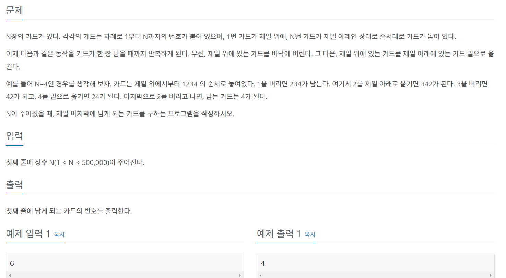

### 내가 푼 풀이
```py
import sys
input = sys.stdin.readline
from collections import deque
a = deque(list(range(1,int(input()) + 1)))
while len(a) != 1:
  a.popleft()
  a.append(a[0])
  a.popleft()
print(a[0])
```
- 1부터 n 까지의 번호의 리스트가 필요한 것을 range()를 사용해 리스트에 넣어서 생성
- 마지막 한 카드가 남을 때까지 while문을 돌림
- 과정을 그대로 작성해주면 된다.
    1. 첫 번째 카드를 버린다.
    2. 처음 카드를 마지막으로 옮긴다.
    3. append를 썼기에 추가만 했을 뿐 옮기지 않았으므로 다시 popleft를 사용해 처음에 위치해 있는 것을 제거해준다.