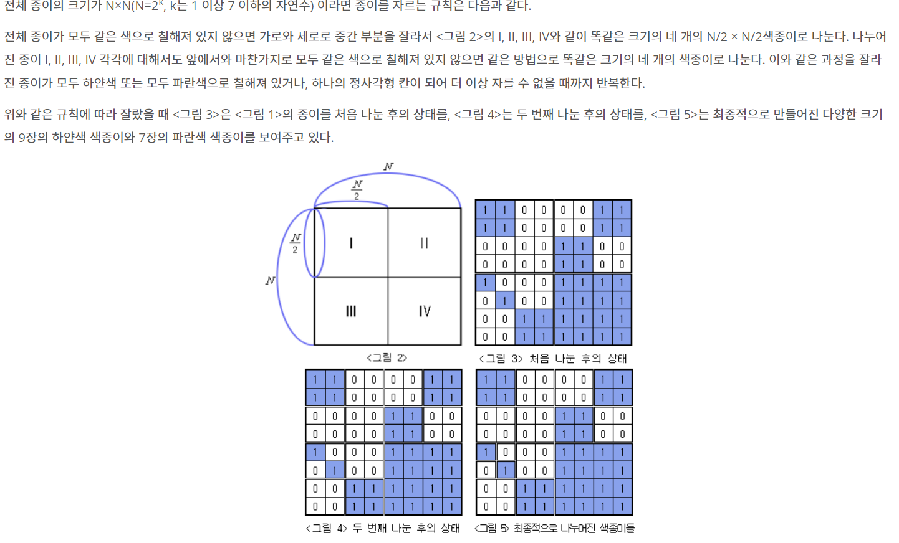

- 풀이 참고 : https://happylsm76.tistory.com/entry/%EB%B0%B1%EC%A4%80-2630%EB%B2%88%EC%83%89%EC%A2%85%EC%9D%B4-%EB%A7%8C%EB%93%A4%EA%B8%B0-with-Python

### 참고하여 푼 코드
```py
import sys
input = sys.stdin.readline
n = int(input())
paper = [list(map(int, input().split())) for _ in range(n)]

result = []

def solution(x,y,n):
  point = paper[x][y]
  for i in range(x, x+n):
    for j in range(y, y+n):
      if point != paper[i][j]:
        solution(x,y,n//2)
        solution(x+n//2,y,n//2)
        solution(x,y+n//2, n//2)
        solution(x+n//2,y+n//2,n//2)
        return
  if point == 0:
    result.append(0)
  else:
    result.append(1)
solution(0,0,n)
print(result.count(0))
print(result.count(1))
```

- 이런 문제는 코테에서 많이 등장하는 유형이길래 도전하였다.
1. 우선 제일 먼저 파악해야하는 것은 나누는 것보다 앞뒤가 처음 지점과 같은 수인지 파악하는 것이다.
2. 만일 같지 않다면 한번 나누는 것을 진행해야하는데 이때 재귀함수로 사용하여 4방향을 나눠 다시 실행시킨다.
3. 문제에서는 0과 1로만 되어 있는 공간의 개수를 파악하는 것이므로 모든 출력이 다 돌아간 이후 남은 점에서 0과 1을 파악해 출력을 진행한다.

다시 풀어보면 좋을 듯!