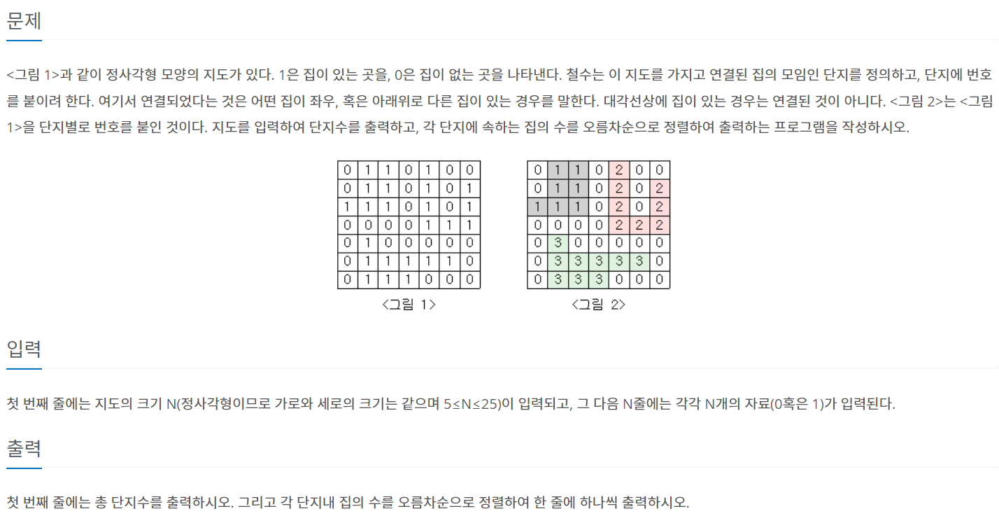

### 유튜브로 공부
```
1.아이디어
- 2중 for문, 값 1 & 방문 X => DFS
- 찾은 값 저장 후 정렬 출력

2. 시간복잡도
- DFS : O(V+E)
- V,E = N^2, 4N^2
- V+E = 5N^2 #상수는 제외 가능 = N^2 =625 <2억

3. 자료구조
- 그래프 저장 int [][]
-방문여부 bool[][]
- 결과값 int[]

```

### 코드
```py
import sys
input = sys.stdin.readline

N = int(input())
mapp = [list(map(int, input().strip())) for _ in range(N)]
chk = [[False]*N for _ in range(N)]

#방문 체크 표시
#DFS로 크기 구하기
# 크기를 결과 리스트에 넣기

result = []
each = 0

dy = [0,1,0,-1]
dx = [1,0,-1,0]

def dfs(y,x):
    global each
    each +=1 #그림 크기 구하는거
    for k in range(4): #4방향 살핌
        ny = y+dy[k]
        nx = x+dx[k]
        if 0<=ny<N and 0<=nx<N:
            if mapp[j][i] ==1 and chk[j][i] ==False:
                chk[j][i] == True
                dfs(ny,nx)


for j in range(N):
    for i in range(N):
        if mapp[j][i] ==1 and chk[j][i] ==False:
            chk[j][i] ==True
            each = 0
            dfs(j,i)
            result.append(each)

result.sort()
print(len(result))
for i in result:
    print(i)

```