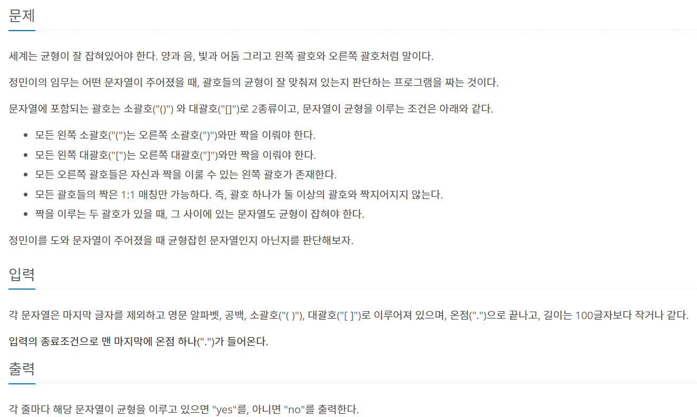

### 내가 푼 풀이
```py
import sys
input = sys.stdin.readline
a = list(input().rstrip())
while a[0] != '.':
  b = 0
  c = 0
  lis = []
  for i in a:
    if b <0 or c<0:
      print('no')
      break
    elif i == '(':
      b +=1
      lis.append('(')
    elif i == ')':
      b -= 1
      if len(lis) == 0:
        break
      elif lis[-1] == '(':
        lis.pop()
      else:
        break
    elif i == '[':
      c +=1
      lis.append('[')
    elif i == ']':
      c -= 1
      if len(lis) == 0:
        break
      elif lis[-1] == '[':
        lis.pop()
      else:
        break
  if b == 0 and c==0:
    print('yes')
  else:
    print('no')
  a = list(input().rstrip())
```
- 모든 조건들을 다 생각해서 if문으로 해결하려고 함.
- 처음 입력 받은 값이 . 이면 끝내야 하므로 while로 시작 후 ( 와 [ 의 개수를 받을 변수를 생성해주고 서로의 짝이 맞아야 하므로 +1, -1 씩 해줌
- 여기서 서로의 순서도 맞아야하므로 리스트를 만들어 추가와 제거를 동시에 실행