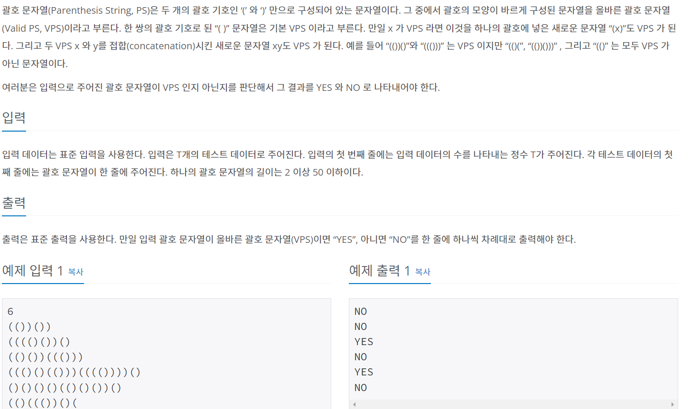

### 내가 푼 풀이
```py
import sys
input = sys.stdin.readline
n = int(input())
result = []
def garo(m):
  k = 0
  for i in range(len(m)):
    if m[i] == '(':
      k +=1
    else:
      k -= 1
    if k == -1:
      result.append('NO')
      return
  if k == 0:
    result.append('YES')
  else:
    result.append('NO')
for j in range(n):
  m = list(input().rstrip())
  garo(m)
for k in result:
  print(k)
```
- 함수를 써서 풀고 싶었으나 너무 복잡해짐
- 성공하긴 했지만 for문을 너무 많이 돌린다는 단점

### 타인의 답
```py
a = int(input())
for i in range(a):
    b = input()
    c = list(b)
    sum = 0
    for i in c:
        if i == '(':
            sum +=1
        elif i == ')':
            sum -= 1
        if sum <0:
            print('NO')
            break
    if sum > 0:
        print('NO')
    elif sum == 0:
        print('YES')
```
- 전체적인 흐름은 비슷하나 확실히 함수를 안쓰는 것이 더 효율적으로 보임